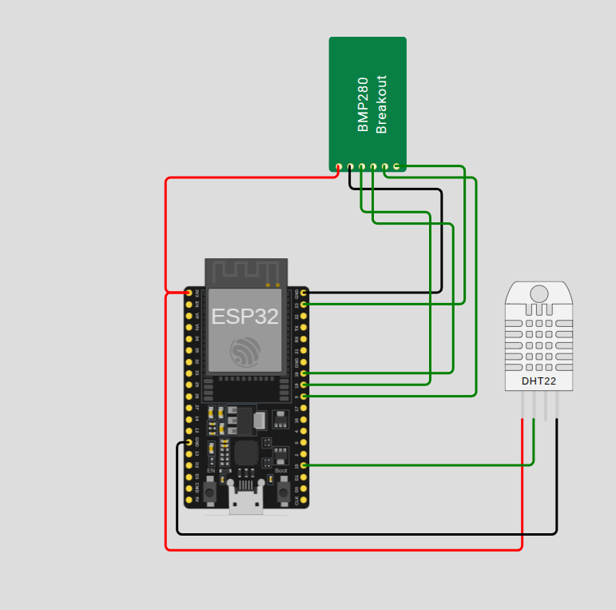
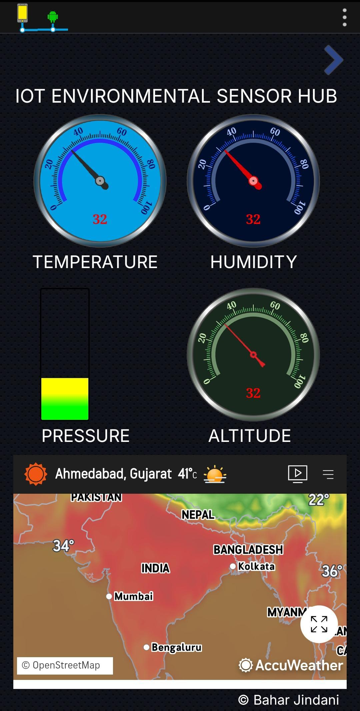

# IoT Environmental Sensor Hub

ESP32-based environmental monitor that streams **temperature, humidity, atmospheric pressure, and altitude** over Wi-Fi to an MQTT broker. Each value is published on its own topic so any MQTT panel app can subscribe directly — no JSON parsing needed.

<p align="center">
  
  &nbsp;&nbsp;&nbsp;
  
</p>

> **Left:** wiring diagram (ESP32 + DHT22 + BMP280).
> **Right:** custom Android MQTT panel app subscribing to the topics this firmware publishes — gauges for temperature, humidity, pressure, altitude.

---

## Features

- **DHT22** — temperature + humidity
- **BMP280** (SPI) — temperature, pressure, altitude
- **MQTT** publishing to `broker.emqx.io:1883`
- One topic per value — drop-in compatible with any MQTT panel/dashboard app
- Includes a **Wokwi simulation** so you can run it without hardware

---

## Repository layout

```
.
├── README.md
├── LICENSE
├── .gitignore
├── IoT_Environmental_Sensor_Hub/
│   └── IoT_Environmental_Sensor_Hub.ino   # the only file you need to flash
├── platformio/platformio.ini              # optional PlatformIO config
├── wokwi/                                 # Wokwi simulator project
│   ├── diagram.json
│   ├── main.py
│   ├── bmp280.py
│   ├── bmp280.chip.c
│   └── bmp280.chip.json
└── docs/
    ├── circuit.png
    ├── WIRING.md
    ├── MQTT.md
    └── legacy_blynk_esp8266.cpp.txt       # original Blynk reference code
```

---

## Hardware

| Qty | Part                        |
|-----|-----------------------------|
| 1   | ESP32 DevKit-C v4           |
| 1   | DHT22 / AM2302              |
| 1   | BMP280 breakout (6-pin SPI) |
| 1   | 10 kΩ resistor (DHT22 pull-up, real hardware only) |

### Wiring

| Sensor | Sensor pin | ESP32 GPIO |
|--------|------------|------------|
| DHT22  | DATA       | 15 |
| BMP280 | SCK        | 18 |
| BMP280 | SDI (MOSI) | 19 |
| BMP280 | SDO (MISO) | 23 |
| BMP280 | CS         | 5  |

Both sensors run on **3V3**. Full table in [docs/WIRING.md](docs/WIRING.md).

---

## Setup (Arduino IDE)

1. Install **ESP32 board support** in Arduino IDE
   (`File → Preferences → Additional Board URLs`):
   ```
   https://raw.githubusercontent.com/espressif/arduino-esp32/gh-pages/package_esp32_index.json
   ```
   then `Tools → Board → Boards Manager → "esp32"`.

2. Install these libraries (Library Manager):
   - **DHT sensor library** (Adafruit)
   - **Adafruit Unified Sensor**
   - **Adafruit BMP280 Library**
   - **ArduinoMqttClient** (Arduino)

3. Open `IoT_Environmental_Sensor_Hub/IoT_Environmental_Sensor_Hub.ino`.

4. Edit the top of the sketch with your Wi-Fi credentials:
   ```cpp
   char ssid[] = "your-wifi-name";
   char pass[] = "your-wifi-password";
   ```

5. `Tools → Board → ESP32 Dev Module`, select port, **Upload**.

6. Open the **Serial Monitor at 9600 baud** — you'll see Wi-Fi/MQTT connect, then a sensor reading dump every 5 seconds.

---

## MQTT topics

The sketch publishes one float value per topic every 5 s:

| Topic                          | Unit  |
|--------------------------------|-------|
| `esp32/dht22/temperature`      | °C    |
| `esp32/dht22/humidity`         | %RH   |
| `esp32/bmp280/temperature`     | °C    |
| `esp32/bmp280/pressure`        | hPa   |
| `esp32/bmp280/altitude`        | m     |

In your panel app, add one widget per topic. Or subscribe to the wildcard `esp32/#` to see all values at once.

Verify from a laptop:
```bash
mosquitto_sub -h broker.emqx.io -p 1883 -t 'esp32/#' -v
```

Full topic spec: [docs/MQTT.md](docs/MQTT.md).

---

## Wokwi simulation (no hardware)

1. Visit <https://wokwi.com/projects/new/micropython-esp32>
2. Replace the project's files with the contents of the `wokwi/` folder
3. Press **Start** — joins `Wokwi-GUEST` and publishes to `broker.emqx.io`

---

## Troubleshooting

| Symptom | Fix |
|---------|-----|
| `BMP280 not found` | re-check SPI wiring (SCK=18, MOSI=19, MISO=23, CS=5) |
| `DHT22 read failed` | add 10 kΩ pull-up between DATA and 3V3, keep delay ≥ 2 s |
| WiFi never connects | ESP32 is **2.4 GHz only**; recheck SSID/password |
| MQTT keeps reconnecting | another device with the same `MQTT_CLIENT_ID` is online — change it |
| Altitude looks wrong | adjust `bmp.readAltitude(1013.25)` to your local sea-level pressure |

---

## License

MIT — see [LICENSE](LICENSE).
